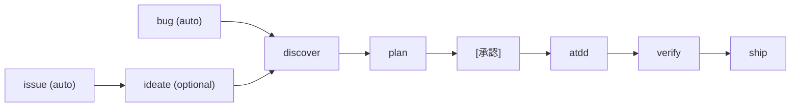
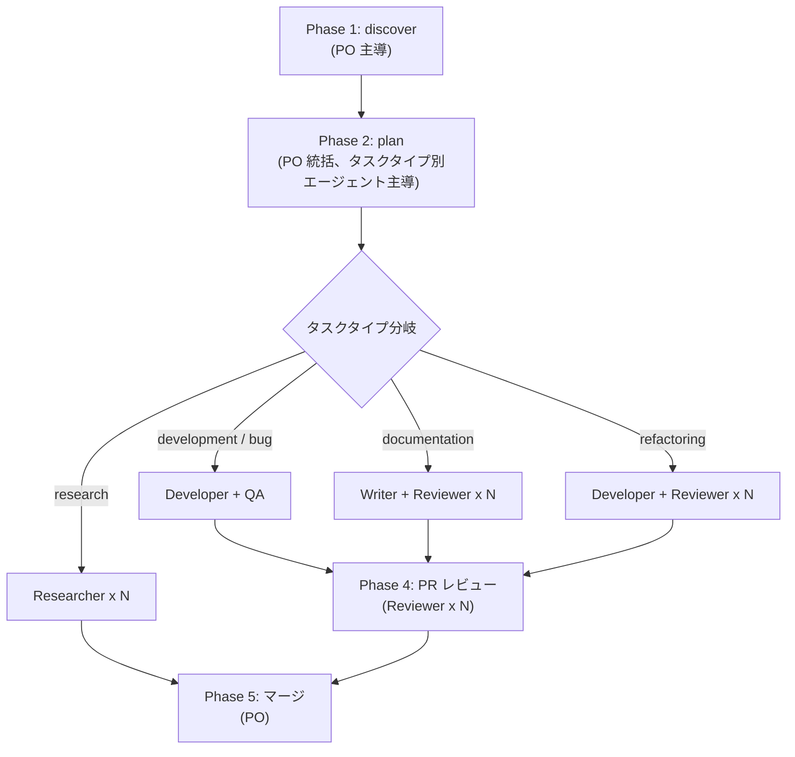

# atdd-kit

[English](README.md)

*このrepositoryの日本語はLLMが英語から直接翻訳しています。ご了承くださいまし

ATDD (Acceptance Test Driven Development) で開発プロセスを回す Claude Code プラグイン。Issue 作成からマージまで一気通貫 — まるで開発プロセスの自動運転。

Issue を作り、要件を整理し、受け入れ基準(AC)を導き出し、テストを先に書き、実装し、検証し、PR をマージする。この一連のワークフローをプラグインとして提供します。

## なぜ atdd-kit？

AI コーディングアシスタントはコードを書けますが、構造化された開発プロセスを持っていません。ガードレールがなければ、要件の探索をスキップし、テストの前にコードを書き、検証なしにマージしてしまいます。

atdd-kit はこの問題を **Issue 駆動・テストファーストのワークフロー** で解決します:

- **すべての変更は Issue から始まる** — 追跡された要件なしにコードは書かない
- **受け入れ基準は対話から導出される** — 推測ではない
- **テストは実装の前に書く** — ATDD ダブルループ（E2E が先、次にユニットテスト）
- **エビデンスベースの検証** — マージ前にすべての AC をテスト結果で検証

設計原則: ゼロ依存、プラグインアーキテクチャ、純粋な markdown + bash。

**Autopilot モード**がハンドルを握ります。PO エージェントがタスクタイプ別チーム — Developer、QA、Tester、Reviewer、Researcher、Writer — を統括し、Issue からマージまで一気通貫。重要なチェックポイントはあなたが承認し、残りはエージェントが処理します。

### ATDD ダブルループ

atdd-kit は Freeman & Pryce の *[Growing Object-Oriented Software, Guided by Tests](https://www.amazon.co.jp/dp/0321503627)*（2009）のダブルループ TDD モデルを実装しています:

```
┌─ 外側ループ: 受け入れテスト ──────────────────────┐
│                                                      │
│  RED       失敗する E2E テストを書く                  │
│                                                      │
│    ┌─ 内側ループ: ユニットテスト ────────────────┐    │
│    │  RED       失敗するユニットテストを書く      │    │
│    │  GREEN     最小限の実装                      │    │
│    │  REFACTOR                     ↻ 繰り返し     │    │
│    └─────────────────────────────────────────────┘    │
│                                                      │
│  GREEN     受け入れテストが通る                       │
│  REFACTOR                                            │
└──────────────────────────────────────────────────────┘
```

影響を受けたもの:

- [ATDD by Example](https://www.amazon.co.jp/dp/0321784154)（Markus Gärtner, 2012）— ATDD の実践ガイド、"ATDD" という用語を広めた書籍
- [obra/superpowers](https://github.com/obra/superpowers) — プロセス強制パターン（Red Flags、`<HARD-GATE>`、Iron Laws）
- [BDD](https://cucumber.io/docs/bdd/)（Dan North）— Given/When/Then 受け入れ基準フォーマット


## クイックスタート

```bash
# 1. マーケットプレイス登録（初回のみ）
claude plugins marketplace add https://github.com/o3-ozono/atdd-kit.git

# 2. インストール（project scope 推奨）
claude plugins install atdd-kit --scope project
```

セットアップは初回セッション時に自動で行われます。`session-start` スキルがプラットフォーム（iOS, Web, Other）を自動検出し、インストールされる内容を表示して確認を求めます。手動でセットアップコマンド（`/atdd-kit:setup-github`、`/atdd-kit:setup-ios` 等）を実行することもできます。各 addon のインストール内容は [Getting Started — What Each Addon Installs](docs/getting-started.md#what-each-addon-installs) を参照してください。

あとは作りたいものを伝えるだけ — atdd-kit が残りを処理します。

エンドツーエンドの walkthrough は [はじめに](docs/getting-started.md) を参照してください。

## ワークフロー



### スキル

#### コアワークフロー

| スキル | 概要 |
|--------|------|
| **discover** | 対話で要件を探索し、受け入れ基準（Given/When/Then）を導出 |
| **plan** | 受け入れ基準からテストファーストの実装計画を作成 |
| **atdd** | ATDD ダブルループを実行（外側: E2E テスト、内側: Unit テスト） |
| **verify** | すべての受け入れ基準がパスすることをエビデンス付きで検証 |
| **ship** | PR 作成、レビューサイクル対応、スカッシュマージ |

#### 自動トリガー

| スキル | 概要 |
|--------|------|
| **issue** | タスク依頼を自動検知し、Issue 作成を開始 |
| **bug** | バグ報告を自動検知し、トリアージパイプラインを開始 |
| **ideate** | 設計探索 -- 探索的リクエストで自動トリガー、issue から discover の間にもチェーン |
| **debugging** | エラー報告を自動検知し、根本原因調査を開始 |
| **skill-gate** | 関連スキルが直接作業の前に呼び出されることを保証 |

#### ユーティリティ

| スキル | 概要 |
|--------|------|
| **session-start** | git 状態、未対応 PR/Issue を報告し、次のタスクを推奨 |
| **sim-pool** | iOS シミュレータプール管理（アドオン） |

### コマンド

| コマンド | 概要 |
|---------|------|
| `/atdd-kit:autopilot` | PO 主導の Autopilot — タスクタイプ別 Agent Teams で Issue を end-to-end 完遂 |
| `/atdd-kit:auto-sweep` | Sweeper ユーティリティ（手動、オンデマンド） |
| `/atdd-kit:auto-eval` | スキル eval 実行（スキル品質のリグレッション検出） |
| `/atdd-kit:setup-github` | GitHub Issue/PR テンプレートとラベルのセットアップ |
| `/atdd-kit:setup-ci` | ベース + アドオンフラグメントから CI ワークフローを生成 |
| `/atdd-kit:setup-ios` | iOS アドオンの手動セットアップ（MCP サーバー、hooks、スクリプト） |
| `/atdd-kit:setup-web` | Web アドオンの手動セットアップ（プレースホルダー） |

## アーキテクチャ

### ワークフローフェーズ



### Agent Teams

PO がタスクタイプ別チームを統括します。7つのエージェントが利用可能:

| エージェント | 役割 | モデル |
|------------|------|--------|
| **PO** | チームリード — ワークフロー統括、コード編集なし | opus |
| **Developer** | ATDD 実装、自己レビュー不可 | sonnet |
| **QA** | テスト戦略と検証、コード編集なし | sonnet |
| **Tester** | バグ再現と修正検証 | sonnet |
| **Reviewer** | 全タスクタイプのコードレビュー、コード編集なし | sonnet |
| **Researcher** | リサーチと分析、コード編集なし | sonnet |
| **Writer** | ドキュメント作成、ファイル編集可能 | sonnet |

**タスクタイプ別エージェント構成**（詳細は [autopilot.md](commands/autopilot.md) を参照）:

| タスクタイプ | Phase 1 エージェント | Phase 2 エージェント |
|------------|---------------------|---------------------|
| development | PO, Developer, QA | PO, Developer, Reviewer x N |
| bug | PO, Tester, Developer | PO, Developer, Tester, Reviewer x N |
| research | PO | PO, Researcher x N（テーマ毎に最低2名） |
| documentation | PO | PO, Writer, Reviewer x N |
| refactoring | PO | PO, Developer, Reviewer x N |

```bash
# in-progress Issue を自動検出して Agent Teams 起動
/atdd-kit:autopilot

# 特定の Issue を指定して起動
/atdd-kit:autopilot 123
/atdd-kit:autopilot search キーワード
```

### ラベルフロー

```
[Issue]  (ラベルなし) → in-progress → ready-for-plan-review → ready-to-go → in-progress
[PR]     ready-for-PR-review → needs-pr-revision（ループ） → マージ
```

詳細は [ワークフロー詳細](docs/workflow-detail.md) を参照。

## 設定

### iOS アドオン

iOS が検出された場合（または `/atdd-kit:setup-ios` で手動セットアップした場合）、アドオンが:
- `.mcp.json` に XcodeBuildMCP、ios-simulator、apple-docs、xcode を追加
- `sim-pool-guard.sh`、`lint-xcstrings.sh` をデプロイ
- PreToolUse hook でシミュレータの排他制御を設定

### 常時ロードルール

毎ターン読み込まれるのは約30行だけ（コンテキスト節約のため最小限）:
- Issue 駆動ワークフローの原則
- コミット規約（Conventional Commits）
- PR ルール（スカッシュマージ）

詳細なガイドは `docs/` にあり、スキルが必要なときに読み込みます。

## コントリビューション

完全な開発ガイドは [DEVELOPMENT.ja.md](DEVELOPMENT.ja.md) を参照してください。主要ルール:

- **バージョニング**: feature PR は必ず `.claude-plugin/plugin.json` のバージョンを上げ、`CHANGELOG.md` を更新する
- **ゼロ依存**: npm パッケージなし、外部サービスなし — 純粋な markdown + bash
- **言語**: LLM 向けファイルは英語のみ。ユーザー向け README/DEVELOPMENT は en/ja ペアで同期

## おすすめの併用ツール

| ツール | 用途 |
|--------|------|
| [swiftui-expert-skill](https://github.com/AvdLee/swiftui-expert-skill) | SwiftUI ベストプラクティス（iOS プロジェクト向け） |

## ライセンス

MIT
