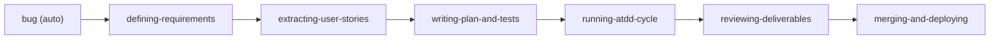

# atdd-kit

[日本語](README.ja.md)

Run your development process with ATDD (Acceptance Test Driven Development) — a structured, test-first path from Issue to merge.

A Claude Code plugin that gives you a complete workflow: create an Issue, explore requirements, derive acceptance criteria, write tests first, implement, review, and merge.

## Why atdd-kit?

AI coding assistants can write code, but they lack a structured development process. Without guardrails, they skip requirements exploration, write code before tests, and merge without verification.

atdd-kit solves this by enforcing an **Issue-driven, test-first workflow**:

- **Every change starts with an Issue** — no code without a tracked requirement
- **Acceptance criteria are derived through dialogue** — not assumed
- **Tests are written before implementation** — ATDD double loop (E2E first, then unit tests)
- **Evidence-based verification** — every AC is verified with test results before merge

Design principles: zero dependencies, plugin architecture, pure markdown + bash.

**A 6-step flow** carries each Issue from requirements to deploy: define requirements → extract user stories → write the plan + acceptance tests → run the ATDD cycle → review → merge & deploy. Each step is a skill you invoke directly, and the review step spawns specialist reviewer subagents that check every deliverable before merge.

### The ATDD Double Loop

atdd-kit implements the Double-Loop TDD model from Freeman & Pryce's *[Growing Object-Oriented Software, Guided by Tests](https://www.amazon.com/Growing-Object-Oriented-Software-Guided-Tests/dp/0321503627)* (2009):

```
┌─ Outer Loop: Acceptance Test ─────────────────────┐
│                                                     │
│  RED       Write a failing end-to-end test          │
│                                                     │
│    ┌─ Inner Loop: Unit Test ────────────────────┐   │
│    │  RED       Write a failing unit test        │   │
│    │  GREEN     Minimal implementation           │   │
│    │  REFACTOR                    ↻ repeat       │   │
│    └─────────────────────────────────────────────┘   │
│                                                     │
│  GREEN     Acceptance test passes                   │
│  REFACTOR                                           │
└─────────────────────────────────────────────────────┘
```

Also influenced by:

- [ATDD by Example](https://www.amazon.com/dp/0321784154) (Markus Gärtner, 2012) — The practical ATDD guide that popularized the term "ATDD"
- [obra/superpowers](https://github.com/obra/superpowers) — Process enforcement patterns (Red Flags, `<HARD-GATE>`, Iron Laws)
- [BDD](https://cucumber.io/docs/bdd/) (Dan North) — Given/When/Then acceptance criteria format


## Quick Start

```bash
# 1. Register the marketplace (first time only)
claude plugins marketplace add https://github.com/o3-ozono/atdd-kit.git

# 2. Install (project scope recommended)
claude plugins install atdd-kit --scope project
```

Setup happens automatically on the first session. The `session-start` skill auto-detects your platform (iOS, Web, Other), shows what will be installed, and asks for confirmation. You can also run setup commands manually (`/atdd-kit:setup-github`, `/atdd-kit:setup-ios`, etc.). See [Getting Started — What Each Addon Installs](docs/guides/getting-started.md#what-each-addon-installs) for details.

Then describe what you want to build — atdd-kit handles the rest.

See [Getting Started](docs/guides/getting-started.md) for a full end-to-end walkthrough.

## How It Works



### Skills

#### Core Workflow (6 steps)

| Step | Skill | What it does |
|------|-------|-------------|
| 1 | **defining-requirements** | Explore requirements through dialogue, derive Given/When/Then acceptance criteria, produce the PRD |
| 2 | **extracting-user-stories** | Derive user stories from the PRD |
| 3 | **writing-plan-and-tests** | Create a test-first implementation plan plus the acceptance tests |
| 4 | **running-atdd-cycle** | Execute the ATDD double loop — outer acceptance tests, inner unit tests |
| 5 | **reviewing-deliverables** | Serially review every deliverable (PRD/US/Plan/Code/AT) with specialist reviewer subagents and produce a single PASS/FAIL |
| 6 | **merging-and-deploying** | Merge → deploy → re-run regression acceptance tests post-deploy |

#### On-demand

| Skill | What it does |
|-------|-------------|
| **writing-design-doc** | Design exploration — trade-offs and alternatives, when a decision needs documenting |
| **launching-preview** | Build and launch a preview for manual confirmation |

#### Auto-trigger

| Skill | What it does |
|-------|-------------|
| **bug** | Auto-detects bug reports and starts the triage pipeline |
| **debugging** | Auto-detects error reports and starts root cause investigation |
| **skill-gate** | Ensures relevant skills are invoked before direct work |
| **skill-fix** | Reports atdd-kit skill defects mid-session; dispatches a background subagent to create a fix Issue without interrupting current work |

#### Utilities

| Skill | What it does |
|-------|-------------|
| **session-start** | Reports git status, open PRs/Issues, and recommends next tasks |
| **sim-pool** | iOS simulator pool management (addon) |
| **ui-test-debugging** | Diagnose flaky or failing UI tests (addon) |

### Commands

| Command | What it does |
|---------|-------------|
| `/atdd-kit:setup-github` | Set up GitHub issue/PR templates and labels |
| `/atdd-kit:setup-ci` | Generate CI workflow from base + addon fragments |
| `/atdd-kit:setup-ios` | Manually set up iOS addon (MCP servers, hooks, scripts) |
| `/atdd-kit:setup-web` | Manually set up Web addon (placeholder) |
| `/atdd-kit:maintenance` | Periodic repo health check (line counts, staleness detection, Issue creation) |
| `/atdd-kit:skill-fix` | Manually trigger the atdd-kit skill-defect report flow |

## Architecture

### Review Subagents

The review step (`reviewing-deliverables`, Step 5) spawns six specialist reviewer subagents serially — each receives an isolated context and checks one deliverable against a fixed set of structural criteria. A final aggregator combines their verdicts into a single PASS/FAIL.

| Agent | Reviews | Criteria |
|-------|---------|----------|
| **prd-reviewer** | PRD (`defining-requirements` output) | 10 |
| **us-reviewer** | User Stories (`extracting-user-stories` output) | 7 |
| **plan-reviewer** | Implementation Plan | 10 |
| **code-reviewer** | Production code changes | 10 |
| **at-reviewer** | Acceptance Tests | 10 |
| **final-reviewer** | Aggregates the 5 specialist verdicts (47 criteria total) → PASS/FAIL | — |

### Label Flow

```
[Issue]  (no label) → in-progress → ready-to-go → in-progress
[PR]     ready-for-PR-review → needs-pr-revision (loop) → merge
```

See [Workflow Detail](docs/workflow/workflow-detail.md) for the full label state machine and transition rules.

## Configuration

### iOS Addon

When iOS is detected (or manually set up via `/atdd-kit:setup-ios`), the addon:
- Adds XcodeBuildMCP, ios-simulator, apple-docs, xcode to `.mcp.json`
- Deploys `sim-pool-guard.sh` and `lint-xcstrings.sh`
- Configures PreToolUse hooks for simulator exclusion

### Always-Loaded Rules

Only ~30 lines loaded every turn (kept minimal to save context):
- Issue-driven workflow principles
- Commit conventions (Conventional Commits)
- PR rules (squash merge)

Detailed guides live in `docs/` and load on-demand.

## Contributing

See [DEVELOPMENT.md](DEVELOPMENT.md) for the full development guide. Key rules:

- **Versioning**: Every feature PR must bump version in `.claude-plugin/plugin.json` and update `CHANGELOG.md`
- **Zero dependencies**: No npm packages, no external services — pure markdown + bash
- **Language**: LLM-facing files are English only. User-facing README/DEVELOPMENT maintain en/ja pairs in sync

## Recommended Companion Tools

| Tool | Purpose |
|------|---------|
| [swiftui-expert-skill](https://github.com/AvdLee/swiftui-expert-skill) | SwiftUI best practices (iOS projects) |

## License

MIT
