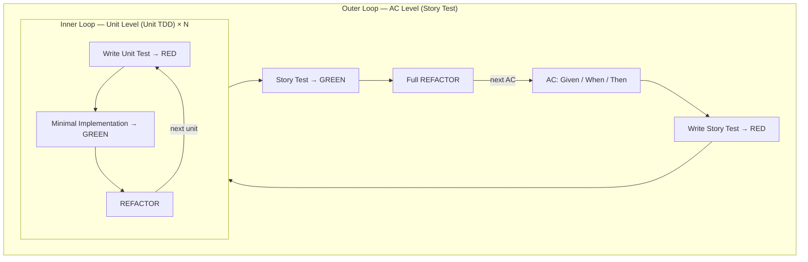

# Test Mapping — AC to Test Layer

> **Loaded by:** plan skill

## AC → Test Layer Mapping

Each AC maps to exactly **one Outer Loop cycle** (Story Test). Within each Outer Loop, the Inner Loop (Unit TDD) runs multiple times — once per unit of behavior needed to make the Story Test pass.

| Level | Loop | Trigger | Test Type |
|-------|------|---------|-----------|
| AC | Outer Loop | 1 AC = 1 Story Test | E2E / Integration |
| Unit behavior | Inner Loop | Runs N times per Outer Loop | Unit Test |

**Key principle (Freeman/Pryce "GOOS"):** The Outer Loop drives the acceptance criterion. The Inner Loop drives the implementation. Both loops must complete before the AC is considered done.

## Testing Quadrants

Based on Crispin/Gregory (2024). Maps each quadrant to atdd-kit test layers:

| Quadrant | Focus | atdd-kit Layer | Loop |
|----------|-------|----------------|------|
| Q1: Unit Test | Supports development — fast feedback on logic | Unit Test | Inner Loop |
| Q2: Story Test | Verifies requirements — AC-driven behavior | E2E / Integration | Outer Loop |
| Q3: Exploratory | Critiques product — manual, outside AC scope | Manual (not tracked in CI) | — |
| Q4: NFR | Performance, security, scalability | Separate performance/security tests | — |

In atdd-kit workflows, **Q1 + Q2 are mandatory** for every AC. Q3 and Q4 are out of scope unless explicitly defined as an AC.

## Double-Loop TDD with AC Correspondence

**AC correspondence rule (Pugh "Lean-Agile ATDD"):** User Story → AC → Acceptance Test is a progression of increasing precision. One AC becomes one Story Test scenario. Never write a Story Test that spans multiple ACs.

## AC Wording → Test Layer Guide

Use this table when selecting test layers in plan Step 3. Match the AC's verb/noun pattern to the appropriate test layer:

| AC wording pattern | Test Layer | Rationale |
|-------------------|------------|-----------|
| "is displayed" / "is visible" / "shows" | Snapshot or E2E | UI rendering — requires visual verification |
| "is calculated" / "is converted" / "returns" | Unit | Pure logic — deterministic, no I/O |
| "is saved" / "is stored" / "persists" | Integration | State persistence — requires real storage layer |
| "is sent" / "is called" / "triggers" | Integration | Side-effect — requires real collaborator or test double at boundary |
| "navigates to" / "transitions to" | E2E | Navigation flow — requires full app stack |
| "can undo" / "can cancel" | E2E or Integration | State management across interactions |

**Decision rule:** When an AC spans multiple patterns, choose the **highest-fidelity layer** (E2E > Integration > Unit). Add Unit tests for extracted logic within the Inner Loop.

## Using Test Mapping in plan Skill

When building the test strategy in plan Step 3, apply this framework per AC:

1. **Identify the AC wording pattern** — use the table above to pick the Outer Loop test layer (E2E or Integration).
2. **Map each AC to one Story Test** — one AC = one Outer Loop cycle. Do not combine ACs into a single Story Test.
3. **Enumerate Inner Loop units** — list the units of behavior the Story Test will require. Each unit maps to one or more Unit Tests.
4. **Classify Q1/Q2** — confirm that Q1 (Unit) and Q2 (Story Test) coverage is complete for every AC. Flag any AC that cannot be covered by Q1/Q2.
5. **Note Q3/Q4 scope** — if an AC implies exploratory or NFR concerns, note them explicitly; they are out of scope for the atdd skill unless a separate AC exists.

**Reference:** [atdd-guide.md](atdd-guide.md) for Double-Loop TDD rules and Inner Loop constraints.
