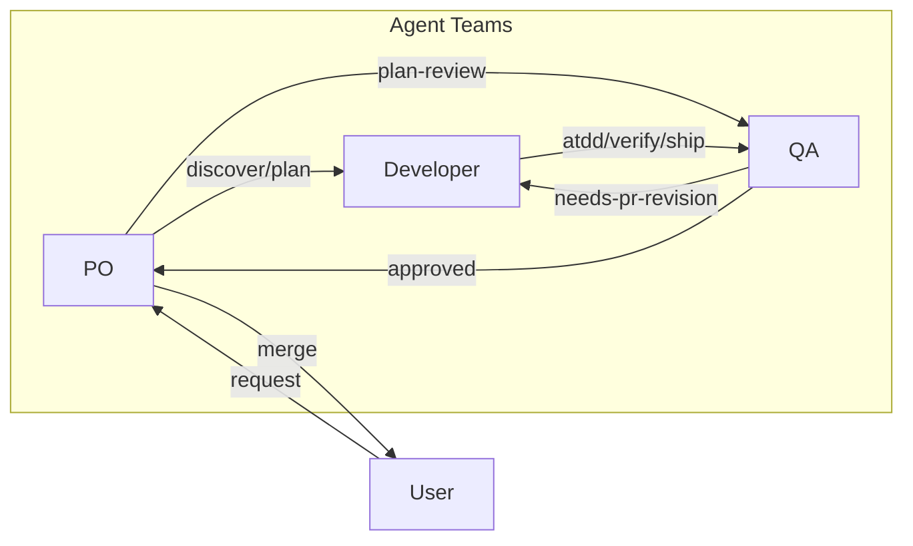
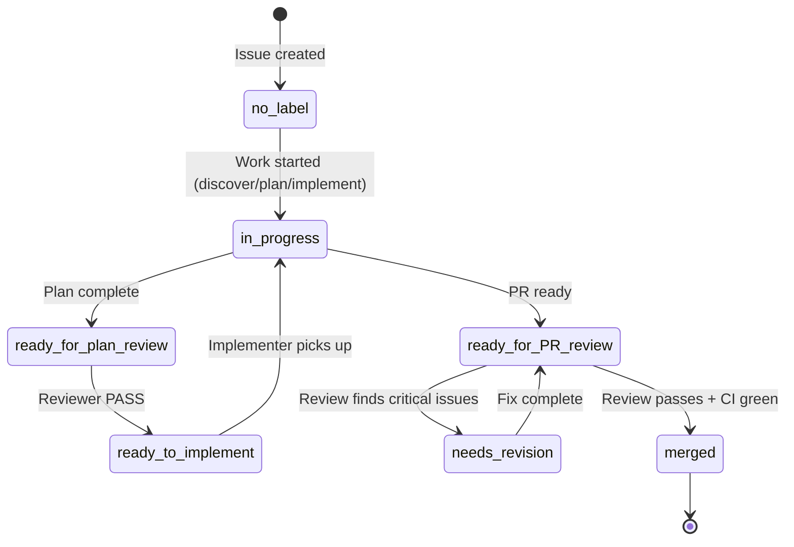
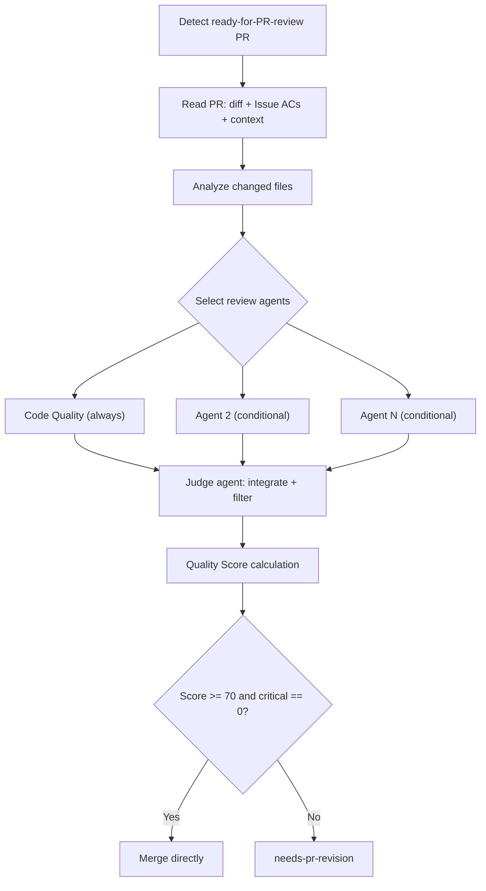
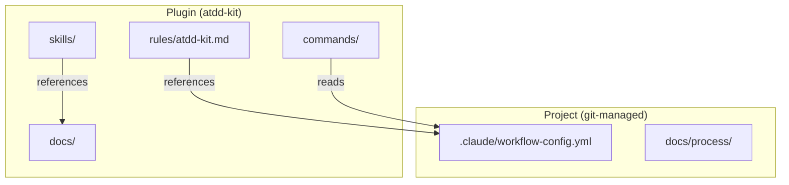

# Workflow Detail

> **Loaded by:** session-start, autopilot

## Label Flow

```
[Issue]
  (no label) --(work started)--> in-progress
  in-progress --(plan complete)--> ready-for-plan-review
  ready-for-plan-review --(Reviewer PASS)--> ready-to-implement
  ready-for-plan-review --(Reviewer: revision needed)--> needs-plan-revision --(fix complete)--> ready-for-plan-review  (loop)
  ready-to-implement --(Implementer picks up)--> in-progress

[PR]
  ready-for-PR-review --> needs-pr-revision --(fix complete)--> ready-for-PR-review  (loop)
                      --> Reviewer merges directly (CI green + blocked-by resolved)
```

### Issue Labels

| Label | Meaning | AI Behavior |
|-------|---------|-------------|
| `in-progress` | Work in progress (exclusive lock) | Someone is actively working on this Issue. Other processes must skip it. |
| `ready-for-plan-review` | Plan complete, awaiting review | Reviewer reviews the plan. |
| `needs-plan-revision` | Plan review found issues | User fixes plan in main session (discover/plan). Implementer does not start. |
| `ready-for-user-approval` | Plan review passed | Reviewer PASS transitions directly to `ready-to-implement`. Retained for autonomy:0 manual approval flow. |
| `ready-to-implement` | Design complete, ready for implementation | Implementer picks it up. |
| `autonomy:0` | Full Control -- all approval gates active | Default if no autonomy label is set. |
| `autonomy:1` | Guided -- AC approval + merge approval only | Plan review auto-approval if R1-R6 PASS. |
| `autonomy:2` | Autonomous -- merge approval only | Plan review and user approval auto-skipped. |
| `autonomy:3` | Full Auto -- fully automated | All gates auto-approved; user retains revert right. |

### PR Labels

| Label | Meaning | AI Behavior |
|-------|---------|-------------|
| `ready-for-PR-review` | Implementation complete, awaiting review | Reviewer starts PR review. |
| `needs-pr-revision` | PR review comments need to be addressed | Implementer fixes -> confirms CI green -> restores `ready-for-PR-review`. |

## Autonomy Levels

See `docs/autonomy-levels.md` for full details. Labels `autonomy:0` through `autonomy:3` control approval gate density.

### Auto-approval Path (Level 1+)

When autopilot (QA) completes with R1-R6 all PASS and the Issue has `autonomy:1` or higher:
- `ready-for-plan-review` → `ready-to-implement` (skipping `ready-for-user-approval`)
- Auto-approval comment posted; user can revert with `needs-plan-revision`

---

## Execution Mode

After plan approval, work proceeds via Agent Teams:

### Agent Teams Mode

Implementer + Reviewer launch as Agent Teams teammates in the user's session. They complete the full cycle (plan-review -> implement -> code-review -> merge) and disband.

**Agent Lifecycle:** Developer and QA agents are spawned once in AC Review Round (with `name: "Developer"` / `name: "QA"`, `isolation: "worktree"`). All subsequent phases (Phase 2, Plan Review, Phase 3, Phase 4) communicate with the same agents via SendMessage — no new Agent generation occurs. This preserves agent context across the full workflow.

**Decision Trail:** Each agent turn writes results to `docs/decisions/{phase}-{role}.md`. These files are committed to the PR, providing a persistent record of all review and strategy decisions. PO reads these files to integrate feedback and posts summaries as Issue comments.

**Worktree Isolation:** PO enters an isolated worktree (`autopilot-{issue_number}`) at Phase 0.9 via EnterWorktree. Developer and QA agents use `isolation: "worktree"` at spawn time for filesystem-level isolation. This enables safe concurrent autopilot sessions on the same repository. Cleanup happens at Phase 5 via ExitWorktree.

**Mid-phase Resume:** When a session restarts at a mid-phase (Phase 2-4), Phase 0.9 re-spawns the required agents (Developer and/or QA depending on the phase) with prior Decision Trail files as context, then continues via SendMessage.

Requires: `CLAUDE_CODE_EXPERIMENTAL_AGENT_TEAMS=1` in `.claude/settings.local.json` `env` (auto-configured by session-start)

Launch with `/atdd-kit:autopilot`:

```
/atdd-kit:autopilot              # Agent Teams (PO + Developer + QA)
/atdd-kit:autopilot 123          # Target a specific Issue
/atdd-kit:autopilot search text  # Search for an Issue by keyword
```

### Manual Utilities

| Utility | How to run | Purpose |
|---------|-----------|---------|
| **Planning** (discover → plan) | User runs in main session | Interactive requirements and design |
| **Sweeper** | `/atdd-kit:auto-sweep` | On-demand state anomaly detection |
| **Skill Eval** | `/atdd-kit:auto-eval` | Run skill evals and detect quality regressions |

### Draft PR Locking

After branching, create an empty commit (`git commit --allow-empty`) and push, then `gh pr create --draft`. This prevents duplicate work on the same Issue.

### Notifications

PR comment for state change notifications.

## Merge Order Control (blocked-by)

When merge order matters, add `blocked-by: #N` to the Issue/PR body. The Implementer checks that the dependency is closed before merging. If not, skip.

## Architecture Overview



## Label State Machine



## Reviewer Parallel Review Flow



## Configuration Layers



## Quality Score

```
Quality Score = 100 - (20 x critical) - (10 x warning) - (3 x suggestion)
```

- Score >= 70 AND critical == 0 -> **APPROVED** (Reviewer merges directly)
- Otherwise -> **NEEDS_REVISION**

## Guardrails

| Rule | Reason |
|------|--------|
| Max 3 review rounds | Prevents infinite revision loops. After 3 rounds -> `needs-human` label. |
| Confidence < 70 filter | Reduces false positives in automated review. |
| git blame exclusion | Only review changes in the PR diff, not pre-existing issues. |
| Only critical blocks merge | Merge-first mindset. Warnings and suggestions are advisory. |
| Fail-open on errors | Review infrastructure errors do not block the workflow. |
| Single responsibility per process | Implementer does not review. Reviewer does not edit code. |

## Troubleshooting

| Problem | Resolution |
|---------|-----------|
| **Label inconsistency** (`ready-for-PR-review` + `needs-pr-revision` both present) | Remove `ready-for-PR-review`. The more restrictive label wins. |
| **Infinite revision loop** (3+ rounds) | Add `needs-human` label. Escalate to user for manual intervention. |
| **Process crash / restart** | Safe to restart. The process picks up from the current label state automatically. |

## Full Workflow

All work follows this flow. No exceptions.

1. **Create Issue** -- From user request or bug report
1.5. **Design exploration (optional)** -- `ideate` brainstorms approaches before requirements (skippable)
2. **Issue Ready flow** -- Execute the flow for the task type, get approval (see `docs/issue-ready-flow.md`)
3. **Branch from main -> Create Draft PR immediately**
   - Branch naming: `<prefix>/<issue-number>-<slug>`
   - Empty commit -> push -> `gh pr create --draft` (description: just `Closes #<issue-number>`)
4. **Implement using the appropriate skill**
5. **Complete in a single small PR**
6. **Documentation consistency check** -- Verify docs related to the changed functionality
7. **Commit -> push -> convert Draft to Ready -> review**
8. **Confirm CI green** -- After PR creation
9. **Merge** -- After review approval + CI green
10. **Clean up workspace** -- `git checkout main && git pull origin main`
