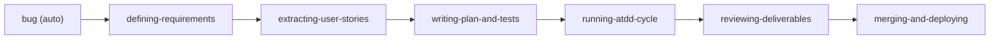
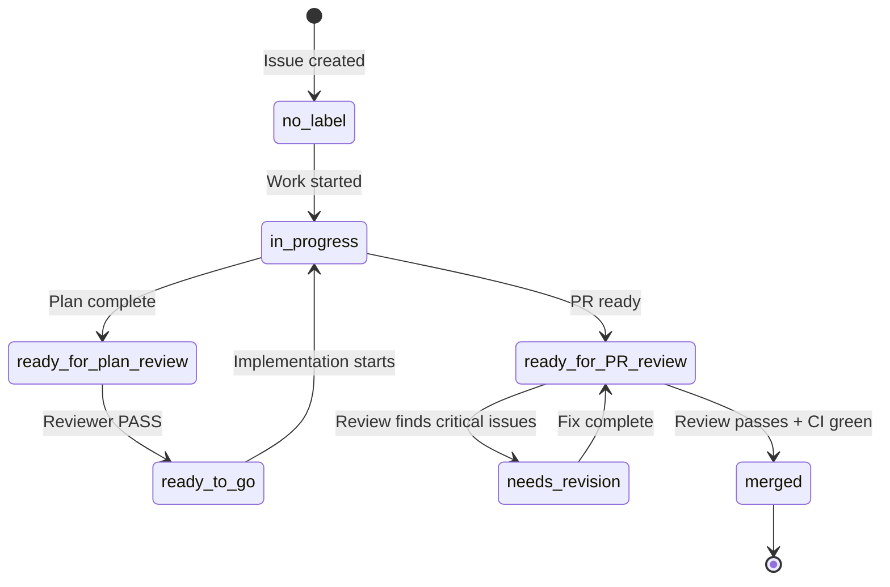
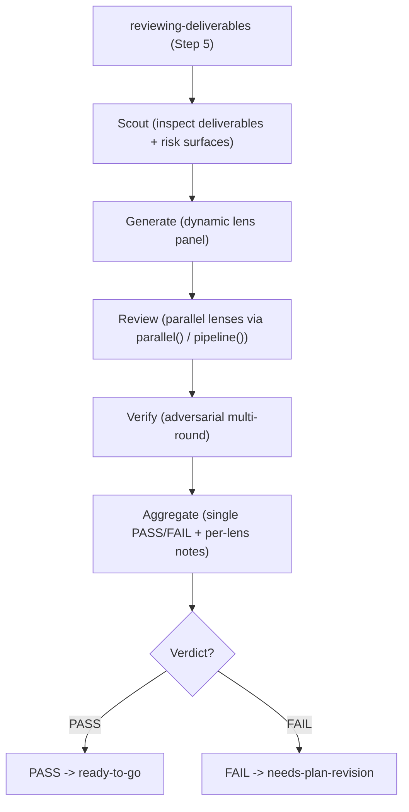
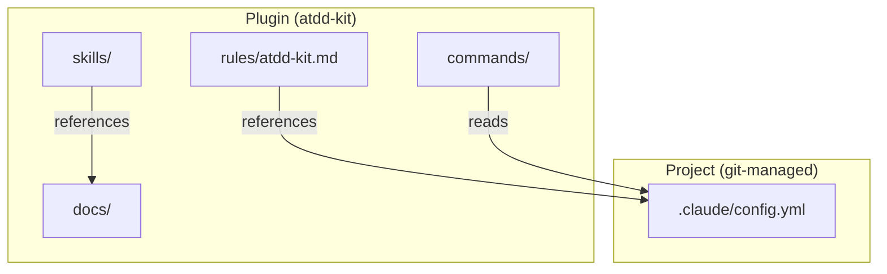

# Workflow Detail

> **Loaded by:** session-start

## Label Flow

```
[Issue]
  (no label) --(work started)--> in-progress
  in-progress --(plan complete)--> ready-for-plan-review
  ready-for-plan-review --(Reviewer PASS)--> ready-to-go
  ready-for-plan-review --(Reviewer: revision needed)--> needs-plan-revision --(fix complete)--> ready-for-plan-review  (loop)
  ready-to-go --(implementation starts)--> in-progress

[PR]
  ready-for-PR-review --> needs-pr-revision --(fix complete)--> ready-for-PR-review  (loop)
                      --> Reviewer merges directly (CI green + blocked-by resolved)
```

### Issue Labels

| Label | Meaning | AI Behavior |
|-------|---------|-------------|
| `in-progress` | Work in progress (exclusive lock) | Someone is actively working on this Issue. Other processes must skip it. |
| `ready-for-plan-review` | Plan complete, awaiting review | `reviewing-deliverables` reviews the plan. |
| `needs-plan-revision` | Plan review found issues | User fixes the plan in the main session (`defining-requirements` / `writing-plan-and-tests`). Implementation does not start. |
| `ready-for-user-approval` | Optional manual approval gate | By default Reviewer PASS transitions directly to `ready-to-go`. Retained for projects that want an explicit user sign-off before implementation. |
| `ready-to-go` | Design complete, ready for implementation | `running-atdd-cycle` picks it up. |
| `blocked-ac` | skill-fix quality gate failed | Subagent could not reach `ready-to-go`; MUST/UX/Interruption gate failed. Manual review required before adding `ready-to-go`. |

### PR Labels

| Label | Meaning | AI Behavior |
|-------|---------|-------------|
| `ready-for-PR-review` | Implementation complete, awaiting review | PR review starts. |
| `needs-pr-revision` | PR review comments need to be addressed | Implementer fixes -> confirms CI green -> restores `ready-for-PR-review`. |

---

## Execution Mode

Work proceeds through the 6-step skill chain, each step invoked directly in the user's session:

`defining-requirements → extracting-user-stories → writing-plan-and-tests → running-atdd-cycle → reviewing-deliverables → merging-and-deploying`

- **Review step** (`reviewing-deliverables`, Step 5) runs a **Workflow**: Scout inspects the deliverables, a reviewer panel is **generated dynamically** from the change, the lenses review **in parallel** (Workflow tool `parallel()` / `pipeline()`), findings are **adversarially verified**, and Aggregate returns a single PASS/FAIL plus per-lens notes.
- **Deliverables** are committed to the Issue's work branch and presented as the Draft PR diff (the commit moment is the Draft PR moment). Issue / PR comments carry **state-change notifications and approval requests only** — never the deliverable body. Knowledge worth long-term reference is graduated into `docs/` or `DEVELOPMENT.md` by explicit human decision.

### Draft PR Locking

After branching, create an empty commit (`git commit --allow-empty`) and push, then `gh pr create --draft`. This prevents duplicate work on the same Issue.

The `in-progress-label.sh` PostToolUse hook (hooks/in-progress-label.sh) automatically adds the `in-progress` label to the linked Issue when `gh pr create --draft` runs, and removes it when the PR is closed or merged. The hook owns this label lifecycle — skill code does not need to manage `in-progress` manually.

### Notifications

PR comment for state change notifications.

### skill-fix Background Dispatch

The `skill-fix` skill dispatches a background subagent to file a fix Issue without interrupting current work. It requires `CLAUDE_CODE_EXPERIMENTAL_AGENT_TEAMS=1` in `.claude/settings.local.json` `env` (auto-configured by session-start).

## Merge Order Control (blocked-by)

When merge order matters, add `blocked-by: #N` to the Issue/PR body. The Implementer checks that the dependency is closed before merging. If not, skip.

## Architecture Overview



## Label State Machine



## Review Workflow Flow

The review step runs a dynamic parallel Workflow: Scout → Generate (dynamic lens panel) → Review (parallel) → Verify (adversarial) → Aggregate (single PASS/FAIL + per-lens notes).



## Configuration Layers



## Quality Score

PR review scores the diff and merges directly when the score clears the bar.

```
Quality Score = 100 - (20 x critical) - (10 x warning) - (3 x suggestion)
```

- Score >= 70 AND critical == 0 -> **APPROVED** (Reviewer merges directly)
- Otherwise -> **NEEDS_REVISION**

## Guardrails

| Rule | Reason |
|------|--------|
| Max 3 review rounds | Prevents infinite revision loops. After 3 rounds -> `needs-human` label. |
| Confidence < 70 filter | Reduces false positives in automated review. |
| git blame exclusion | Only review changes in the PR diff, not pre-existing issues. |
| Only critical blocks merge | Merge-first mindset. Warnings and suggestions are advisory. |
| Fail-open on errors | Review infrastructure errors do not block the workflow. |
| Single responsibility per process | Implementer does not review. Reviewer does not edit code. |

## Troubleshooting

| Problem | Resolution |
|---------|-----------|
| **Label inconsistency** (`ready-for-PR-review` + `needs-pr-revision` both present) | Remove `ready-for-PR-review`. The more restrictive label wins. |
| **Infinite revision loop** (3+ rounds) | Add `needs-human` label. Escalate to user for manual intervention. |
| **Process crash / restart** | Safe to restart. The process picks up from the current label state automatically. |

## Full Workflow

All work follows this flow. No exceptions.

1. **Create Issue** -- From user request or bug report
1.5. **Design exploration (optional)** -- `writing-design-doc` documents trade-offs and alternatives before requirements (skippable)
2. **Issue Ready flow** -- Execute the flow for the task type, get approval (see `docs/workflow/issue-ready-flow.md`)
3. **Branch from main -> Create Draft PR immediately**
   - Branch naming: `<prefix>/<issue-number>-<slug>`
   - Empty commit -> push -> `gh pr create --draft` (description: just `Closes #<issue-number>`)
4. **Implement using the appropriate skill**
5. **Complete in a single small PR**
6. **Documentation consistency check** -- Verify docs related to the changed functionality
7. **Commit -> push -> convert Draft to Ready -> review**
8. **Confirm CI green** -- After PR creation
9. **Merge** -- After review approval + CI green
10. **Clean up workspace** -- `git checkout main && git pull origin main`
